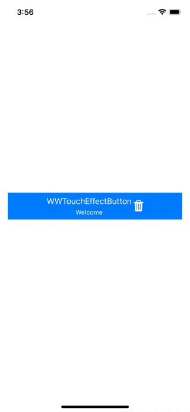
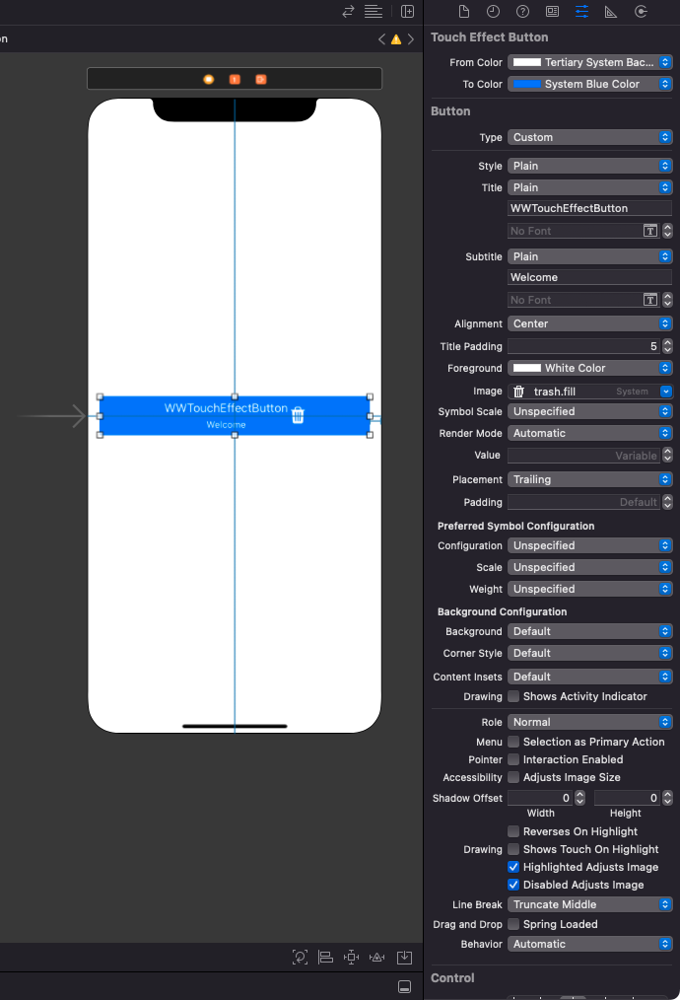

# WWTouchEffectButton
[](https://developer.apple.com/swift/) [](https://developer.apple.com/swift/)  [](https://developer.apple.com/swift/) [](https://developer.apple.com/swift/)

### [Introduction - 簡介](https://swiftpackageindex.com/William-Weng)
- Imitating the function of Android Button, there will be a visual reaction when you click or long press.
- 仿Android Button的功能，讓在點擊或長按的時候，會有視覺上的反應。



### [Installation with Swift Package Manager](https://medium.com/彼得潘的-swift-ios-app-開發問題解答集/使用-spm-安裝第三方套件-xcode-11-新功能-2c4ffcf85b4b)
```bash
dependencies: [
    .package(url: "https://github.com/William-Weng/WWTouchEffectButton.git", .upToNextMajor(from: "1.0.0"))
]
```



### WWTouchEffectButtonDelegate
|函式|功能|
|-|-|
|touch(_:event:)|點擊的事件|
|longPress(_:state:)|長按的狀態|

### Example
```swift
import UIKit
import WWPrint
import WWTouchEffectButton

final class ViewController: UIViewController {
    
    @IBOutlet weak var myTouchEffectButton: WWTouchEffectButton!
    
    override func viewDidLoad() {
        super.viewDidLoad()
        myTouchEffectButton.delegate = self
    }
}

extension ViewController: WWTouchEffectButtonDelegate {
    
    func touch(_ button: WWTouchEffectButton, event: UIControl.Event) {
        wwPrint("event => \(event)")
    }
    
    func longPress(_ button: WWTouchEffectButton, state: UIGestureRecognizer.State) {
        wwPrint("state => \(state)")
    }
}
```
